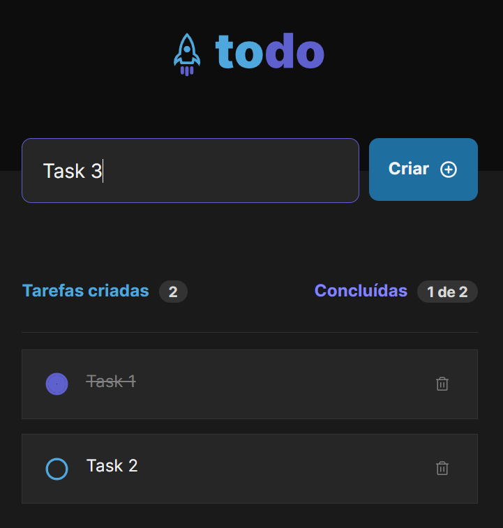

# Rocketseat: Ignite

About Rocketseat Ignite Bootcamp: [https://lp.rocketseat.com.br/ignite](https://lp.rocketseat.com.br/ignite)

## ReactJS Challenge 01: Todo List App

## Project's requirements & layout

 [https://efficient-sloth-d85.notion.site/Desafio-01-Praticando-os-conceitos-do-ReactJS-91fd63dd1a5b4a2796152de293ec1074](https://efficient-sloth-d85.notion.site/Desafio-01-Praticando-os-conceitos-do-ReactJS-91fd63dd1a5b4a2796152de293ec1074)

## How to run

- Clone the repo: ``git clone ...``
- Install dependencies: ``npm i``
- Run: ``npm run dev``
